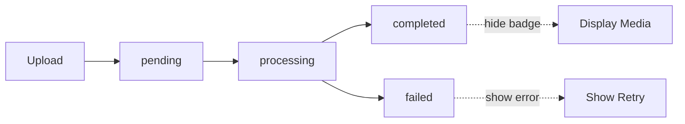

# Media Updates Summary

This document summarizes the real-time media processing system implemented for burg-ink.

## 🎯 What Was Implemented

### 1. Real-Time Processing Updates
- **Frontend automatically updates** as images are being processed
- **No status badges for completed items** - clean UI
- **Loading indicators** for pending/processing states
- **Error indicators** with retry option for failed items

### 2. Backend Processing Flow



**Status Progression:**
1. **pending** → Just uploaded, waiting in queue
2. **processing** → Actively resizing and analyzing
3. **completed** → Done (stored in DB, not shown to user)
4. **failed** → Error occurred (shows retry UI)

### 3. Key Files Created/Updated

#### New Files:
- `src/pages/api/media/[id]/status.ts` - Status polling endpoint
- `src/hooks/useMediaProcessing.ts` - React hook for real-time updates
- `src/components/MediaProcessingIndicator.tsx` - Loading/error UI component
- `src/components/UploadWithProgress.example.tsx` - Integration example
- `REALTIME_MEDIA_PROCESSING.md` - Complete documentation

#### Updated Files:
- `src/pages/admin/media.tsx` - Integrated real-time updates
- `src/lib/functions/processMediaUpload.ts` - Added AI analysis & error handling
- `src/lib/ai.ts` - Added `analyzeMediaImage()` function
- `src/pages/api/upload/local.ts` - Fixed datatype mismatch (null vs empty strings)
- `db/schema.ts` - Already had correct schema
- Database - Recreated media table with correct structure

## 🔧 Technical Details

### Database Schema (Media Table)
```sql
CREATE TABLE media (
  id TEXT PRIMARY KEY NOT NULL,                    -- UUID
  original_url TEXT NOT NULL,
  medium_url TEXT,                                 -- Populated after processing
  thumbnail_url TEXT,                              -- Populated after processing
  source TEXT NOT NULL,                            -- 'local' | 'gdrive'
  source_id TEXT,
  tags TEXT DEFAULT '[]',                          -- AI-generated tags
  title TEXT,                                      -- AI-generated title
  description TEXT,                                -- AI-generated description
  alt_text TEXT,                                   -- AI-generated alt text
  created_at INTEGER DEFAULT (unixepoch()) NOT NULL,
  user_id INTEGER,
  filename TEXT,
  mime_type TEXT,
  size INTEGER,
  processing_status TEXT DEFAULT 'pending',        -- 'pending'|'processing'|'completed'|'failed'
  FOREIGN KEY (user_id) REFERENCES users(id)
);
```

### Processing Pipeline

1. **Upload** (`/api/upload/local`)
   - Upload original to DigitalOcean Spaces
   - Create DB record with `status: 'pending'`
   - Trigger Inngest event `media/process`
   - Return immediately with media ID

2. **Process** (Inngest function `processMediaUpload`)
   - Update status to `'processing'`
   - Download original from storage
   - Generate medium (1200px) and thumbnail (400px) versions
   - Upload resized versions to storage
   - Run AI analysis (GPT-4o Vision)
   - Update DB with URLs, metadata, and `status: 'completed'`
   - On error: set `status: 'failed'`

3. **Frontend Polling** (React hook `useMediaProcessing`)
   - Poll `/api/media/{id}/status` every 2 seconds
   - Stop when status is `completed` or `failed`
   - Auto-refresh media list when done
   - Show appropriate UI indicators

### AI Analysis

Uses OpenAI GPT-4o to extract:
- **Tags** - Keywords for search/categorization
- **Title** - Concise, descriptive title (3-8 words)
- **Description** - Short summary (1-2 sentences)
- **Alt Text** - Accessibility description

**Example Output:**
```json
{
  "tags": ["landscape", "mountains", "sunset", "nature", "golden hour"],
  "title": "Mountain Sunset Landscape",
  "description": "A breathtaking mountain vista at golden hour with warm orange and pink hues illuminating the peaks.",
  "altText": "Mountain landscape at sunset with golden and pink light casting dramatic shadows across snow-capped peaks"
}
```

## 🎨 Frontend Integration

### Admin Media Page

The `/admin/media` page now:
- ✅ Shows loading spinners on items being processed
- ✅ Auto-updates when processing completes
- ✅ Shows error indicators for failed items
- ✅ No status badges on completed items (clean look)
- ✅ Uses AI-generated titles instead of filenames
- ✅ Displays AI-generated descriptions and tags

### How It Works

Each media item in the grid uses the `MediaItemWithProcessing` wrapper:

```tsx
<MediaItemWithProcessing item={item}>
  <MediaCard>
    {/* Shows processing overlay if pending/processing */}
    {isProcessing(item) && (
      <MediaProcessingIndicator processing overlay />
    )}
    
    {/* Shows error overlay if failed */}
    {item.processing_status === 'failed' && (
      <MediaProcessingIndicator failed overlay />
    )}
    
    {/* No badge shown for completed items */}
  </MediaCard>
</MediaItemWithProcessing>
```

The wrapper component automatically:
1. Detects if item is processing
2. Starts polling the status endpoint
3. Refreshes the media list when done
4. Stops polling when complete/failed

## 🚀 How to Use

### 1. Start Your Servers
```bash
# Terminal 1 - Next.js
yarn dev

# Terminal 2 - Inngest
yarn inngest:dev
```

### 2. Upload an Image
- Go to `/admin/media`
- Upload an image
- Watch it process in real-time!

### 3. What You'll See

**During Upload:**
- "Uploading..." indicator

**After Upload (pending → processing):**
- Spinning loading indicator overlay on the image card
- "Processing your image..." message

**After ~5-10 seconds (completed):**
- Loading indicator disappears
- Image updates with resized version
- AI-generated title, description, and tags appear
- No status badge visible (clean look)

**If Error (failed):**
- Error indicator with red "!" icon
- "Processing failed" message
- Retry button (if configured)

## 📊 Status Tracking

The `useMediaProcessing` hook handles all the complexity:

```typescript
const { status, isProcessing, error } = useMediaProcessing({
  mediaId: '123',
  pollInterval: 2000,        // Poll every 2 seconds
  onComplete: (data) => {
    // Called when processing finishes
    console.log('Done!', data);
  },
  onError: (error) => {
    // Called if processing fails
    console.error('Failed:', error);
  },
});
```

**Hook Features:**
- ✅ Automatic polling
- ✅ Stops when done/failed
- ✅ Configurable interval
- ✅ Callbacks for events
- ✅ Manual refresh option

## 🔍 Monitoring & Debugging

### Check Inngest Dashboard
```
http://localhost:8288
```

View:
- Function executions
- Step-by-step progress
- Errors and logs
- Retry failed jobs

### Check Media Status Directly
```bash
# Get status of specific media
curl http://localhost:3000/api/media/{mediaId}/status

# Example response (processing):
{
  "id": "abc-123",
  "status": "processing",
  "processing": true,
  "failed": false,
  "data": null
}

# Example response (completed):
{
  "id": "abc-123",
  "status": "completed",
  "processing": false,
  "failed": false,
  "data": {
    "original_url": "...",
    "medium_url": "...",
    "thumbnail_url": "...",
    "title": "Mountain Landscape",
    "description": "Beautiful mountain vista...",
    "alt_text": "Snow-capped mountains...",
    "tags": ["mountains", "nature", "landscape"],
    "filename": "IMG_1234.jpg"
  }
}
```

### Check Database Directly
```bash
sqlite3 db.sqlite "SELECT id, filename, processing_status, title FROM media ORDER BY created_at DESC LIMIT 5;"
```

## 🎯 Benefits

1. **Better UX**
   - Immediate feedback during upload
   - Real-time progress updates
   - Clear error states
   - No confusing status badges on completed items

2. **AI-Powered Metadata**
   - Automatic tagging
   - SEO-friendly descriptions
   - Accessibility alt text
   - Searchable content

3. **Scalable Architecture**
   - Background processing (non-blocking)
   - Error recovery
   - Concurrent processing (6 at a time)
   - Monitoring and observability

4. **Clean Code**
   - Reusable hook
   - Composable components
   - Type-safe
   - Well-documented

## 🐛 Known Issues & Fixes

### Sharp Installation
If you see sharp library errors, run:
```bash
rm -rf node_modules/@img node_modules/sharp node_modules/.cache
yarn add sharp
```

### Inngest Not Registering Functions
Make sure:
1. Sharp is properly installed (see above)
2. `/api/inngest` endpoint loads without errors
3. Inngest dev server is running
4. Next.js dev server is running

### Media Not Updating
Check:
1. Inngest dashboard for function execution
2. Browser console for polling errors
3. Network tab for status API calls
4. Database for actual status values

## 📝 Notes

- **Polling is temporary**: Can be upgraded to WebSockets or SSE for true real-time
- **Status badges**: Only shown for pending/processing/failed, not completed
- **AI analysis**: Runs automatically, has fallback values if it fails
- **Error handling**: Comprehensive - failed items don't break the system
- **Database**: Status is stored as 'completed' but not displayed

## 🎉 Result

Users can now:
1. Upload images and see them immediately in the grid
2. Watch as images are processed with a loading indicator
3. See the final result auto-update when ready
4. Get AI-generated metadata automatically
5. Know immediately if something failed

All without any page refreshes or manual status checking!

